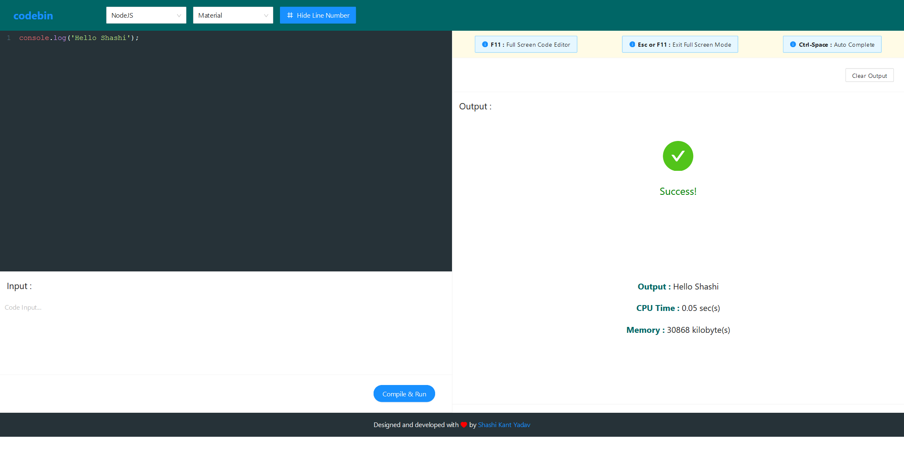

# Codebin : Online IDE & Compiler;

Codebin is developed in [ReactJS](https://reactjs.org/) framework and [Ant Design](https://ant.design/) UI library. The user friendly online compiler that allows us to write code of various programming languages and run it online. We can customize the code language and the theme of our choice.

### Demo : [Link](https://codebin.netlify.app/)

### Edit and Play : [Codesandbox](https://o4fei.csb.app/)

### Screenshots :

  

### Built With :

- [ReactJS](https://reactjs.org/)
- [Ant Design](https://ant.design/)
- [CodeMirror](https://codemirror.net/)

### Developed By :

- [Shashi Kant Yadav](https://github.com/imboss712)

### License :

- [ISC License](https://choosealicense.com/licenses/isc/)
